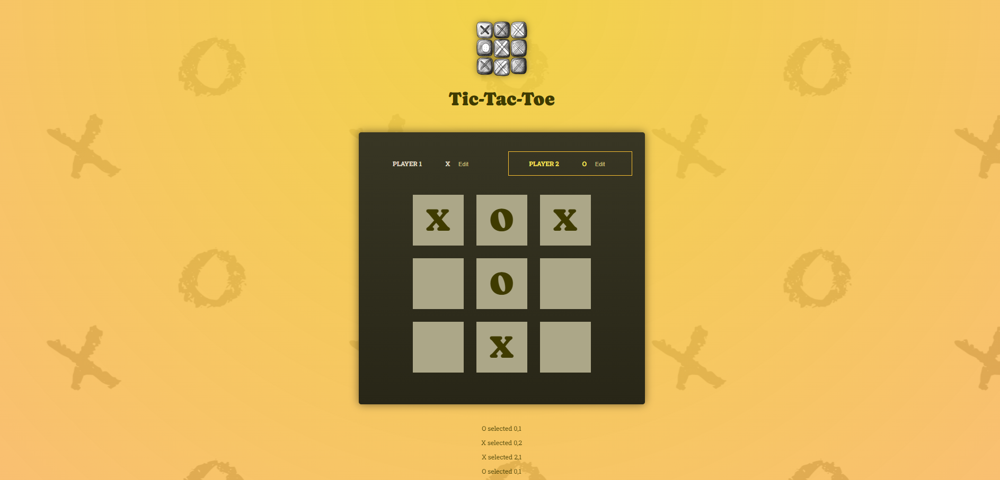

"# tic-tac-react" 

Tic Tac React is a simple tic-tac-toe game written using JS and JSX React.

To run, clone repo. In the folder you cloned the repo into run the following.

npm install
npm run dev

This will install all the required packages and start a local webserver with the game loaded. 